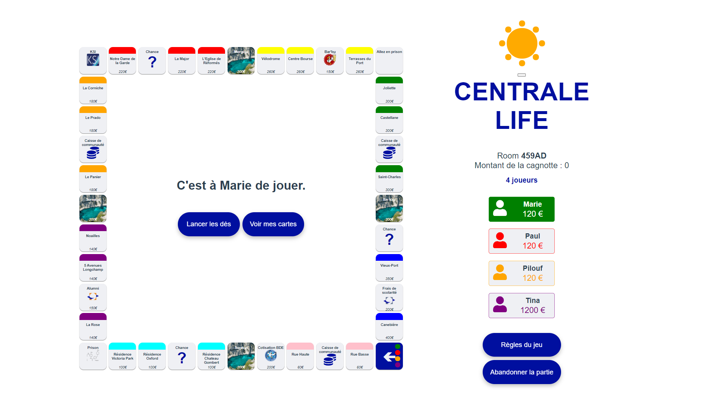

Centrale Life est un jeu de plateau inspiré de la vie centralienne. On peut y jouer en multijoueur grâce à un websocket.

## Technologies utilisées

### Vue.js

La partie front du projet est en [Vue.js](https://vuejs.org/). 
Vue.js est un framework JavaScript utilisé pour construire des interfaces utilisateur et des applications web monopages.

#### Créer un projet en Vue

Il y a plusieurs façons d'intégrer Vue à son projet :
- [CDN](https://vuejs.org/v2/guide/installation.html#CDN)
- [NPM](https://vuejs.org/v2/guide/installation.html#NPM)
- [CLI](https://vuejs.org/v2/guide/installation.html#CLI)

Pour ce projet, nous avons fait une application Vue CLI. 
Pour pouvoir en faire une, il faut [installer Vue sur votre ordinateur](https://cli.vuejs.org/guide/installation.html).
Pour [créer le projet](https://cli.vuejs.org/guide/creating-a-project.html#vue-create), il faut exécuter :

```
vue create nameProject
```


### Node.js et Express

La partie back en [Node.js](https://nodejs.org/en/) avec le framework [Express](https://expressjs.com/fr/).
Node.js est un environnement d'exécution permettant d'utiliser le JavaScript côté serveur.
Express est un framework pour construire des applications avec Node.js.

#### Créer un projet Express

Une fois [Node.js](https://nodejs.org/en/) installé, vous pouvez créer un projet Express en faisant :
```
mkdir myapp     # Création du dossier de votre projet
cd my app       # Aller dans ce dossier
npm init        # Création du package.json
```

Le entry point est généralement index.js ou server.js dans notre cas.

```
npm install express --save  # Installation d'Express
```

[En savoir plus](https://expressjs.com/fr/starter/installing.html)


### La particularité de notre projet : les Websocket

Pour faire simple, le protocole HTTP est unidirectionnel, c'est-à-dire que le transfert de données se fait uniquement dans un sens et pas dans les deux sens en même temps.
Le protocole HTTP marche sur un modèle de requête - réponse.

_Exemple_ \
Le serveur envoie des données au client (ordinateur, téléphone ...), puis va attendre la réponse du client pour faire autre chose.

Le websocket est bidirectionnel, c'est-à-dire que le transfert de données peut se faire dans les deux sens en même temps.
Ainsi, le serveur peut envoyer des informations de lui-même sans que le client les demande et inversement.

_Exemple_ \
Lorsque vous recevez un message, c'est le serveur qui vous envoie de lui-même cette information même si vous ne l'avez pas demandé.

[En savoir plus](https://www.ionos.fr/digitalguide/sites-internet/developpement-web/quest-ce-que-le-websocket/)

Pour le websocket, nous avons utilisé [Socket.IO](https://socket.io/).
Socket.IO est une librairie permettant une communication en temps réel, bidirectionnelle et basée sur des événements entre le navigateur et le serveur.

Par exemple, pour notre jeu, nous envoyons les événements suivants :
- Un nouveau joueur a rejoint la partie.
- J'ai lancé les dés.
- J'ai fait un choix.
- J'ai mis à jour les données du jeu.

Voici le schéma pour le lancer de dés :


Pour l'installer : 

```
npm install socket.io
```

> Intéressant : \
> Le [HTTP/2](https://fr.wikipedia.org/wiki/Hypertext_Transfer_Protocol/2) permet de remplir quelques fonctionnalités du Websocket, notamment la possibilité au serveur 
> d'envoyer au client des données nécessaires mais qu'il n'a pourtant pas demandé.
 

### Test

#### Test unitaire

Les tests unitaires permettent de tester des fonctions et de vérifier qu'elles renvoient bien ce qu'il faut.

Pour cela, nous utilisons [Jest](https://jestjs.io/). Pour l'installer :

```
npm install --save-dev jest
```

> **Pourquoi _--save-dev_ et pas juste _--save_ ?** \
> _--save-dev_ va installer cette dépendance en tant que devDependencies, c'est-à-dire uniquement dans un environnement de développement.
> En environnement de production, on exécutera `npm install --production`. Cette dépendance ne sera donc pas installée.
> En effet, on ne fait pas de test en environnement de production.

Il est possible de faire des [tests avec jest](https://socket.io/docs/v4/testing/#example-with-jest) sur les websockets.

Dans utils.js, nous avons des fonctions que nous n'exportons pas.
Pour pouvoir tout de même les tester, nous utilisons [Rewire](https://github.com/jhnns/rewire).

Cependant, pour notre projet Vue, nous utilisons le package [babel-plugin-rewire](https://github.com/speedskater/babel-plugin-rewire) qui s'inspire de Rewire.

Pour l'installer :

```
npm install babel-plugin-rewire --save-dev
```
[En savoir plus](https://www.samanthaming.com/journal/2-testing-non-exported-functions/#non-export-function)

Pour lancer les tests, il faut exécuter :

```
npm test
```

#### User story

Les user stories sont des petites histoires qui décrivent une utilisation possible du site.
Cela permet de tester si une suite d'actions est possible.

Pour cela, nous avons utilisé [selenium](https://www.selenium.dev/documentation/).

Comme Selenium va utiliser notre site, il lui faut un navigateur web :
- `geckodriver` pour Firefox
- `chromedriver` pour Chrome

> **Attention**
> Pour les fichiers avec des users stories, il est important de les appeler _nomdufuchier.user-story.js_.

Pour les installer :
```
npm install --save-dev selenium-webdriver chromedriver geckodriver
```

Il y a trois tests :
- create room : pour vérifier si la création de salle est possible
- roll dice : pour vérifier si le lancer de dés est possible
- play game : après avoir lancé les dés, on clique sur le bouton ok

Pour lancer ces tests :

```
npm test -- --testRegex="user-story.js"
```

> **Pourquoi pas _npm test_ comme pour les tests unitaires ?** \
> Justement, on vous a dit que les fichiers devaient s'appeler _nomdufuchier.user-story.js_.
> _npm test_ va lancer les tests unitaires avec jest (qui termine par .test.js).
> _--testRegex="user-story.js"_ va donc filtrer les fichiers terminant par _user-story.js_.

## Le jeu

### Le plateau du jeu

Le plateau du jeu est constitué de 40 cases.
Les joueurs ainsi que leurs soldes sont visibles à droite du plateau.

Le centre du plateau donne les informations du jeu : qui joue ? que doit-il faire ? quel choix peut-il faire ? ...

Les règles du jeu sont disponibles en cliquant sur le bouton **Règles du jeu**.

Quand un joueur est en faillite (c'est-à-dire quand il n'a plus assez d'argent pour payer une taxe ou un loyer), il est éliminé. Le but du jeu est d'être la dernière personne à ne pas être en faillite.



### Améliorations possibles du jeu

Pour améliorer ce jeu, nous avons plusieurs idées :
- une interface admin qui permet de gérer les différentes salles
- l'ajout de maisons et d'hôtels
- lorsque l'on a plusieurs calanques ou compagnies, le loyer change (exemple : le loyer est proportionnel au nombre de calanques que possède la personne.)
- la possibilité d'hypothéquer les propriétés pour récupérer de l'argent
- un mode nuit avec des règles différentes (vol, cambriolage de maisons, agression ...)

## Conclusion du projet

Ce projet a été l'occasion pour nous de découvrir Vue et plus généralement de faire un projet avec les technos à la mode :
Vue, Node, Express. Cela nous a permis d'apprendre des concepts et de coder différement.
Les Websockets sont compliqués à mettre en place, il vaut mieux faire directement l'architecture du projet avec les websockets
plutot que de les ajouter après.

## Comment on y joue ?

Vous pouvez aller sur nos sites [Sauge](http://node.sauge.ovh1.ec-m.fr/) et [Marjolaine](http://node.marjolaine.ovh1.ec-m.fr) ou vous pouvez installer le rpjet en local.

### Installer le projet

Vous pouvez retrouver le code source du projet sur [ce github](https://github.com/amenasria/CentraleLife).

Pour cloner le projet, vous pouvez faire :
- en HTTPS :
```
git clone https://github.com/amenasria/CentraleLife.git
```
- en SSH :
```
git clone git@github.com:amenasria/CentraleLife.git
```

Une fois que vous avez recupérer le code source, il faut exécuter les commandes suivantes :

```
npm install    # Installation des dépendances du backend
cd front
npm install    # Installation des dépendances du frontend
```


### Lancer le projet en mode développement


```
node server.js    # Lancer le backend
```
```
cd front
npm run serve     # Démarrer un serveur de développement pour le projet Vue
```

### Lancer le projet en production

Compiler le projet Vue dans le dossier ./front/dist :

```
cd front
npm run build
```

> **Pourquoi _npm run serve_ en développement et _npm run build_ en production ?** \
> _npm run serve_ compile le projet Vue à chaque fois que le code est modifié.
> En production, le code n'est pas censé changer. Il ne faut donc le compiler qu'une fois : lorsqu'on fait _npm run build_.


N'oubliez pas de décommenter la ligne app.bind... qui indique au site d'utiliser le dossier front/dist.

Ensuite :
```
node server.js
```