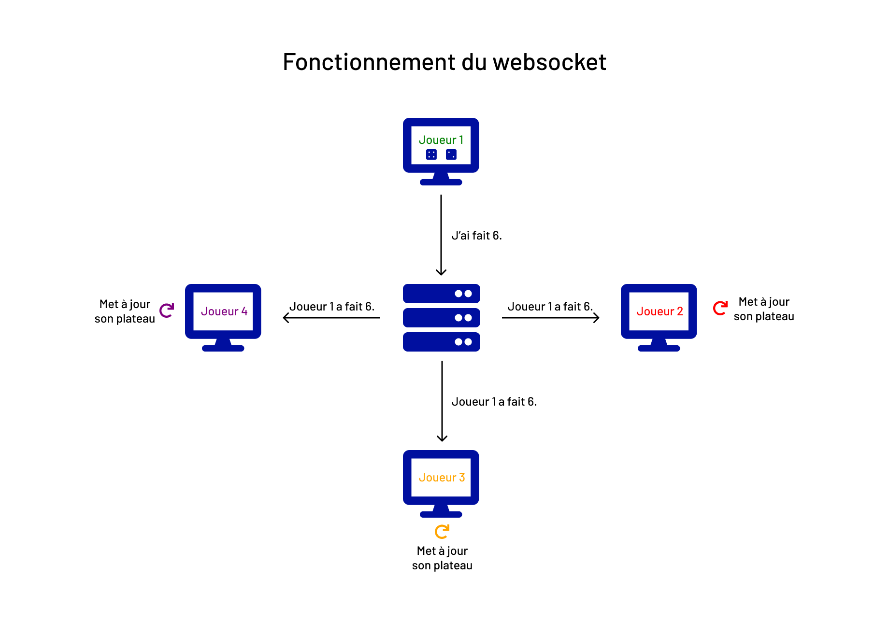

Centrale Life est un jeu de plateau inspiré de la vie centralienne. On peut y jouer en multijoueur grâce à un websocket.

## Technologies utilisées

### Vue.js

La partie front du projet est en [Vue.js](https://vuejs.org/). 
Vue.js est un framework JavaScript utilisé pour construire des interfaces utilisateur et des applications web monopages.

#### Créer un projet en Vue

Il y a plusieurs façons d'intégrer Vue à son projet :
- [CDN](https://vuejs.org/v2/guide/installation.html#CDN)
- [NPM](https://vuejs.org/v2/guide/installation.html#NPM)
- [CLI](https://vuejs.org/v2/guide/installation.html#CLI)

Pour ce projet, nous avons fait une application Vue CLI. 
Pour pouvoir en faire une, il faut [installer Vue sur votre ordinateur](https://cli.vuejs.org/guide/installation.html).
Pour [créer le projet](https://cli.vuejs.org/guide/creating-a-project.html#vue-create), il faut exécuter :

`vue create nameProject`


### Node.js et Express

La partie back en [Node.js](https://nodejs.org/en/) avec le framework [Express](https://expressjs.com/fr/).
Node.js est un environnement d'exécution permettant d'utiliser le JavaScript côté serveur.
Express est un framework pour construire des applications avec Node.js.

#### Créer un projet Express

Une fois [Node.js](https://nodejs.org/en/) installé, vous pouvez créer un projet Express en faisant :
```
mkdir myapp     # Création du dossier de votre projet
cd my app       # Aller dans ce dossier
npm init        # Création du package.json
```

Le entry point est généralement index.js ou server.js dans notre cas.

```
npm install express --save  # Installation d'Express
```

[En savoir plus](https://expressjs.com/fr/starter/installing.html)


### Websocket

Pour le websocket, nous avons utilisé [Socket.IO](https://socket.io/).
Socket.IO est une librairie permettant une communication en temps réel, bidirectionnelle et basée sur des événements entre le navigateur et le serveur.

Par exemple, pour notre jeu, nous envoyons les événements suivants :
- Un nouveau joueur a rejoint la partie.
- J'ai lancé les dés.
- J'ai fait un choix.
- J'ai mis à jour les données du jeu.

Voici le schéma pour le lancer de dés :



### Test

#### Test unitaire

Les tests unitaires permettent de tester des fonctions et de vérifier qu'elles renvoient bien ce qu'il faut.

Pour cela, nous utilisons [Jest](https://jestjs.io/). Pour l'installer :

```
npm install --save-dev jest
```

Dans utils.js, nous avons des fonctions que nous n'exportons pas. 
Pour pouvoir tout de même les tester, nous utilisons [Rewire](https://github.com/jhnns/rewire).

Cependant, pour notre projet Vue, nous utilisons le package [babel-plugin-rewire](https://github.com/speedskater/babel-plugin-rewire) qui s'inspire de Rewire.

Pour l'installer :

```
npm install babel-plugin-rewire --save-dev
```
[En savoir plus](https://www.samanthaming.com/journal/2-testing-non-exported-functions/#non-export-function)

Pour lancer les tests, il faut exécuter :

```
npm test
```

#### User story

Les user stories sont des petites histoires qui décrivent une utilisation possible du site.
Cela permet de tester si une suite d'actions est possible.

Pour cela, nous avons utilisé [selenium](https://www.selenium.dev/documentation/).
Il y a trois tests :
- create room : pour vérifier si la création de salle est possible
- roll dice : pour vérifier si le lancer de dés est possible
- play game : après avoir lancé les dés, on clique sur le bouton ok

Pour lancer ces tests :

```
npm test -- --testRegex="user-story.js"
```

## Lancer le projet

### Installer le projet

Après avoir cloné le dépôt, il faut exécuter les commandes suivantes :

```
npm install    # Backend dependecencies installation
cd front
npm install    # Frontend dependecencies installation
```


### Lancer le projet en mode développement


```
node server.js    # Run backend
```
```
cd front
npm run serve     # Starts a dev server (for the frontend)
```

### Lancer le projet en production

Build vue project to ./front/dist static folder:
```
cd front
npm run build
```

Don't forget to uncomment the app.bind.... line which bind to the static front/dist folder

Then:
```
node server.js
```
